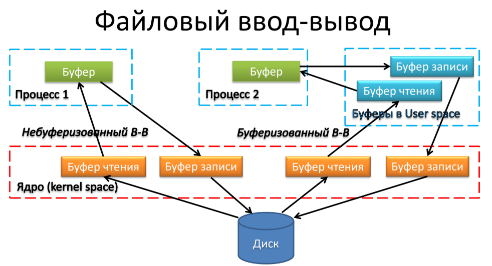

# Задание 03 (Файлы).
Скорректировать решение задачи о книге контактов из модуля 2 так, чтобы список контактов хранился в файле.
Использовать небуферизованный ввод-вывод. Данные выводятся/считываются блоками, соответствующими структуре для представления сведений о контакте (структуре целиком, а не по отдельным полям). Для этого в структуре не должно быть указателей (строки хранятся как массивы фиксированной длины).
При запуске программы список считывается из файла, при завершении программы список записывается в файл.
Учесть, что при запуске программы может не быть сохраненных данных.

  

## contact.h

Для начала уберем все указатели и заменим их статическими массивами  
```c
// структура контакта
typedef struct Contact {
    unsigned int uid;
    char firstName[MAX_STRING_LENGTH]; // было char* firstName;
    char lastName[MAX_STRING_LENGTH]; // было char* lastName;
...
```
## contact.c
Изменим функцию создания контакта (вместо динамического выделения памяти и инициализации указателей просто копируем имя и фамилию в статические массивы)

*ДО:*
```c
Contact* createContact(const char* firstName, const char* lastName) {
...

    // инициализируем указатели как NULL
    contact->firstName = NULL;
    contact->lastName = NULL;
    
    contact->firstName = malloc(strlen(firstName) + 1);
    if (contact->firstName == NULL) {
        free(contact);
        return NULL;
    }
    
    contact->lastName = malloc(strlen(lastName) + 1);
    if (contact->lastName == NULL) {
        free(contact->firstName);
        free(contact);
        return NULL;
    }

    strcpy(contact->firstName, firstName);
    strcpy(contact->lastName, lastName);

...
```
*ПОСЛЕ:*
```c
Contact* createContact(const char* firstName, const char* lastName) {
...

    strncpy(contact->firstName, firstName, MAX_STRING_LENGTH - 1);
    contact->firstName[MAX_STRING_LENGTH - 1] = '\0';
    
    strncpy(contact->lastName, lastName, MAX_STRING_LENGTH - 1);
    contact->lastName[MAX_STRING_LENGTH - 1] = '\0';

...
```
*+*
 ```c
 ...

    // инициализация массивов
    for (int i = 0; i < MAX_PHONES; i++) {
        contact->phones[i][0] = '\0';
    }
    for (int i = 0; i < MAX_EMAILS; i++) {
        contact->emails[i][0] = '\0';
    }
    for (int i = 0; i < MAX_SOCIALS; i++) {
        contact->socials[i].platform[0] = '\0';
        contact->socials[i].profile[0] = '\0';
    }

...
 ```

Функция отчистки контакта:  

*ДО:*
```c
void freeContact(Contact* contact) {
    if (contact == NULL) return;
    
    free(contact->firstName);
    free(contact->lastName);
    free(contact);
}
```
*ПОСЛЕ:*
```c
void freeContact(Contact* contact) {
    if (contact == NULL) return;
    free(contact);
}
```
Также изменим сеттеры (чтобы работали со статическими массивами):

*ДО:*
```c
int setContactFirstName(Contact* contact, const char* firstName) {
    if (contact == NULL || firstName == NULL) return 0;
    
    char* newFirstName = malloc(strlen(firstName) + 1);
    if (newFirstName == NULL) return 0;
    
    free(contact->firstName);
    contact->firstName = newFirstName;
    strcpy(contact->firstName, firstName);
    return 1;
}

int setContactLastName(Contact* contact, const char* lastName) {
    if (contact == NULL || lastName == NULL) return 0;
    
    char* newLastName = malloc(strlen(lastName) + 1);
    if (newLastName == NULL) return 0;
    
    free(contact->lastName);
    contact->lastName = newLastName;
    strcpy(contact->lastName, lastName);
    return 1;
}
```
*ПОСЛЕ:*
```c
int setContactFirstName(Contact* contact, const char* firstName) {
    if (contact == NULL || firstName == NULL) return 0;
    
    strncpy(contact->firstName, firstName, MAX_STRING_LENGTH - 1);
    contact->firstName[MAX_STRING_LENGTH - 1] = '\0';
    return 1;
}

int setContactLastName(Contact* contact, const char* lastName) {
    if (contact == NULL || lastName == NULL) return 0;
    
    strncpy(contact->lastName, lastName, MAX_STRING_LENGTH - 1);
    contact->lastName[MAX_STRING_LENGTH - 1] = '\0';
    return 1;
}
```
## phonebook.h

Объявим константу имени файла телефонной книги:
```c
#define PHONEBOOK_FILENAME "phonebook.dat"
```
Добавим функции для работы с файлами (небуферизованный ввод-вывод)
```c
int loadPhonebookFromFile(Phonebook* pb, const char* filename);
int savePhonebookToFile(const Phonebook* pb, const char* filename);
```

## phonebook.c

+3 новые библиотеки:
```c
#include <unistd.h>
#include <fcntl.h>
#include <sys/stat.h>
```
Реализация функций работы с файлами:
```c
// функция загрузки телефонной книги из файла (небуферизованный ввод)
int loadPhonebookFromFile(Phonebook* pb, const char* filename) {
    if (pb == NULL || filename == NULL) return 0;
    
    // открываем файл для чтения
    int fd = open(filename, O_RDONLY);
    if (fd == -1) {
        // файл не существует это ок при первом запуске
        return 1;
    }
    
    // считываем количество контактов
    int count;
    ssize_t bytes_read = read(fd, &count, sizeof(int));
    if (bytes_read != sizeof(int)) {
        close(fd);
        return 0;
    }
    
    // считываем nextUid
    bytes_read = read(fd, &pb->nextUid, sizeof(unsigned int));
    if (bytes_read != sizeof(unsigned int)) {
        close(fd);
        return 0;
    }
    
    // считываем контакты
    for (int i = 0; i < count && i < MAX_CONTACTS; i++) {
        Contact* contact = (Contact*)malloc(sizeof(Contact));
        if (contact == NULL) {
            close(fd);
            return 0;
        }
        
        bytes_read = read(fd, contact, sizeof(Contact));
        if (bytes_read != sizeof(Contact)) {
            free(contact);
            close(fd);
            return 0;
        }
        
        pb->contacts[i] = contact;
        pb->count++;
    }
    
    close(fd);
    return 1;
}

// функция сохранения телефонной книги в файл (небуферизованный вывод)
int savePhonebookToFile(const Phonebook* pb, const char* filename) {
    if (pb == NULL || filename == NULL) return 0;
    
    // открываем файл для записи (создаем, если не существует)
    int fd = open(filename, O_WRONLY | O_CREAT | O_TRUNC, 0644);
    if (fd == -1) {
        return 0;
    }
    
    // записываем количество контактов
    ssize_t bytes_written = write(fd, &pb->count, sizeof(int));
    if (bytes_written != sizeof(int)) {
        close(fd);
        return 0;
    }
    
    // записываем nextUid
    bytes_written = write(fd, &pb->nextUid, sizeof(unsigned int));
    if (bytes_written != sizeof(unsigned int)) {
        close(fd);
        return 0;
    }
    
    // записываем контакты
    for (int i = 0; i < pb->count; i++) {
        if (pb->contacts[i] != NULL) {
            bytes_written = write(fd, pb->contacts[i], sizeof(Contact));
            if (bytes_written != sizeof(Contact)) {
                close(fd);
                return 0;
            }
        }
    }
    
    close(fd);
    return 1;
}
```
## main.c
В мэйне нам нужно добавить только загрузку телефонной книги из файла и сохраниение файла:
```c
    printf("Загрузка телефонной книги из файла...\n");
    if (loadPhonebookFromFile(&phonebook, PHONEBOOK_FILENAME)) {
        printf("Телефонная книга успешно загружена. Контактов: %d\n", getPhonebookContactCount(&phonebook));
    } else {
        printf("Не удалось загрузить телефонную книгу из файла. Будет создана новая.\n");
    }
```
сохраняем в файл при завершении:
```c
    printf("Сохранение телефонной книги в файл...\n");
    if (savePhonebookToFile(&phonebook, PHONEBOOK_FILENAME)) {
        printf("Телефонная книга успешно сохранена. Контактов: %d\n", getPhonebookContactCount(&phonebook));
    } else {
        printError("Не удалось сохранить телефонную книгу в файл!");
    }
    
    freePhonebook(&phonebook);
    printf("Программа завершена. До свидания!\n");
    
    return 0;
```
## А что с остальными?
файлы работы с интерфейсом не меняем тк они не зависят от способа хранения данных. 

## Запуск
```c
make
hexdump -C phonebook.dat | less
```